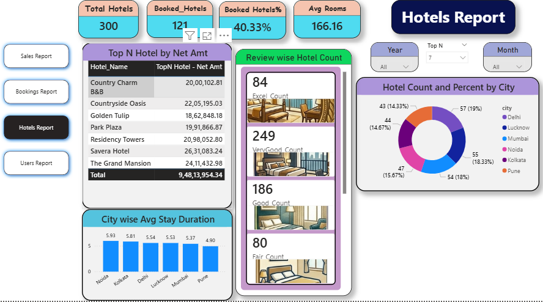
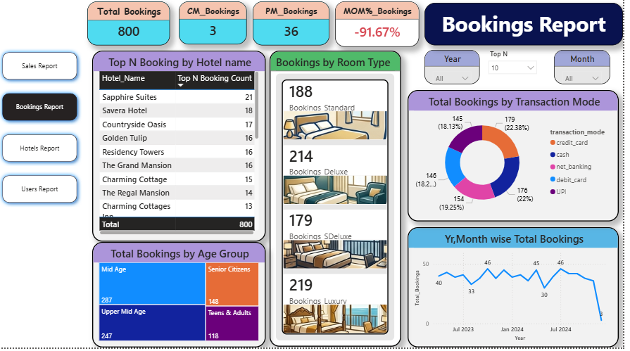
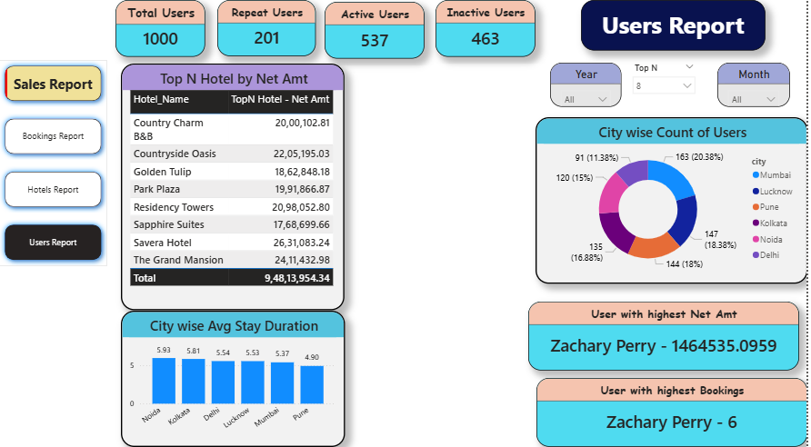
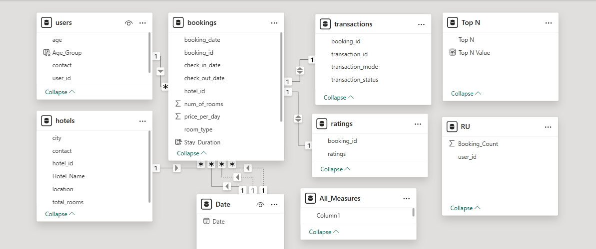

# Hotel Bookings Dashboard using Power BI

## 📌 Project Overview
This project is an interactive **Hotel Bookings Dashboard** created using **Power BI** to analyze hotel booking data and generate meaningful business insights for the hospitality industry.

The dashboard helps in understanding:
- Booking trends
- Customer behavior
- Revenue performance
- Sales analysis
- Hotel performance metrics

---

## 📊 Dashboards Included

### 🏨 Hotel Dashboard
Provides an overview of:
- Total bookings
- Booking status
- Revenue analysis
- Hotel performance insights

## Hotel Dashboard

---

### 📅 Bookings Dashboard
Displays:
- Booking trends over time
- Reservation patterns
- Customer booking behavior
- Cancellation insights

---

### 💰 Sales Dashboard
Shows:
- Revenue analysis
- Sales performance
- Profit-related insights
- Business growth indicators

.png)

---

### 👥 Users Dashboard
Analyzes:
- User demographics
- Customer distribution
- User activity patterns

---

### 🔗 Data Model View
Represents relationships between tables used in the Power BI project.

---

## 🛠️ Tools & Technologies Used
- Power BI
- Data Cleaning
- Data Visualization
- DAX
- Data Modeling

---

## 📂 Files in Repository

| File Name | Description |
|-----------|-------------|
| `Hotel_Bookings_Report (1).pbix` | Main Power BI project file |
| `Hotels_Dashboard.png` | Hotel dashboard screenshot |
| `Bookings_Dashboard.png` | Bookings dashboard screenshot |
| `Sales_Dashboard (1).png` | Sales dashboard screenshot |
| `Users_Dashboard.png` | Users dashboard screenshot |
| `Model_View.png` | Data model screenshot |

---

## 📈 Key Insights
- Booking patterns and seasonal trends can be identified easily.
- Revenue contribution from different booking categories is visualized.
- Customer behavior and booking preferences are analyzed.
- Dashboard enables quick business decision-making through interactive visuals.

---

## 🚀 How to Use
1. Download the `.pbix` file from this repository.
2. Open it using **Power BI Desktop**.
3. Explore the interactive dashboards and insights.

## Author
Smita Patil  
Aspiring Data Analyst
